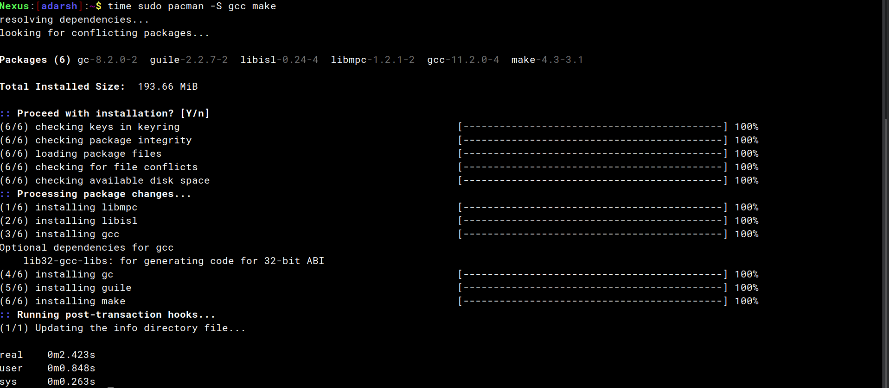

## Introduction

The pacman package manager is one of the major distinguishing features of Arch Linux. It combines a simple binary package format with an easy-to-use build system. The goal of pacman is to make it possible to easily manage packages, whether they are from the official repositories or the user&rsquo;s own builds.


## How its better than other package managers

-   It installs all dependencies of a particular program or software.This is convenient to users. The user need not seperately install all the other dependencies or waste time in searching them.
-   It searches in a wide list of repos and looks for different versions of that particular software.
-   It supports regex and patter descriptions that help in downloading specific versions.
-   The latest version of pacman , **pacman 6.0** supports `ParallelDownloads` which helps in downloading and building packages very fast.


## Usage


### Installing a single package or a list of packages
```bash
sudo pacman -S package_name1 package_name2 ...
```

### Install using regex
```bash
sudo pacman -S $(pacman -Ssq package_regex)
```

### Remove a package
```bash
sudo pacman -R package_name
```

### Updating all packages in system
```bash
sudo pacman -Syu
```

## So how is pacman 6.0 better than the previous versions?

### ParallelDownloads

The latest pacman version is 6.0. The major change for this release is the implementation of parallel downloads. Yes, this feature downloads multiple files at the same time.

1. Open `/etc/pacman.conf` in your preferred editor\
Example:
```bash
sudo vim /etc/pacman.conf
```
2. Find the following line and uncomment it:
```text
ParallelDownloads = 5
```
3. Save the file and try downloading some package. From now on, you will notice that the file download happens in parallel when you perform any pacman transaction.

### Comparison 

> Please note:\
> For this comparison, after each test all required files are purged so as to abide by the integrity of the comparison.

I am using simple packages `gcc` and `make` for this comparison.The speed is measured using `time` command in Linux.

#### With Parallel Downloads 


#### Without Parallel Downloads




1. It can be seen that ParallelDownloads take less time to download the packages.

2. This is greatly helpful for downloading multiple packages.

### Bibliography

* [Pacman-Arch Wiki](https://wiki.archlinux.org/title/pacman)
* [Pacman-Wikipedia](https://en.wikipedia.org/wiki/Arch_Linux#Pacman)
* [Parallel Downloads in Pacman](https://ostechnix.com/enable-parallel-downloading-in-pacman-in-arch-linux/)

