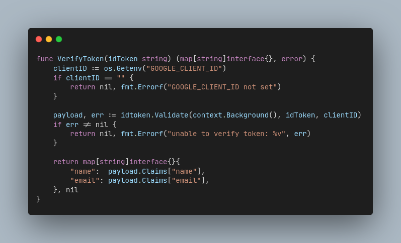
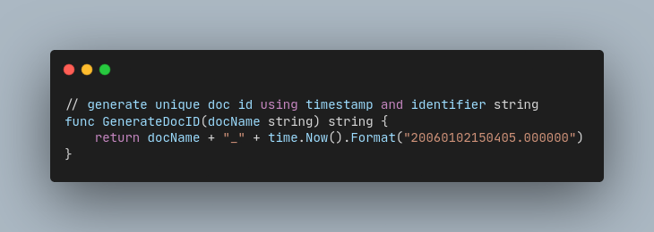

# Building an Event Management System

_Authors: [Lalith B Seervi](https://github.com/lalithbseervi)_

## Why Eventloop?
Managing events and hackathons involves a lot of steps -- from getting registrations, shortlisting participants/teams, checking the details of each participant at the venue, and verifying them at various checkpoints until the event is complete.

Eventloop aims to make this much simpler and faster. We have a form-builder integrated into the site, and a rapid QR code system for permitting participants at the various checkpoints.

## Tech Stack
Frontend: NextJS
Backend: Gin (Go-lang based web-framework)
Database: Couchbase Capella
Authentication: Google OAuth-based JWT Authentication
Deployment: Vercel Serverless Functions

## Wait, wasn't Eventloop built previously?
Some of you may know that Eventloop was a project that started outside of Tilde and was also being used in events. So, you might wonder, why is this being re-built? Well, to start with, the original Eventloop had certain drawbacks and limitations that needed to be solved, and also needed new features.

## Week 0: Ideation Phase (July 6 - 12)
During the first week, we explored different ways in which we could rewrite the backend, and settled on ExpressJS since it was easy-to-use, had excellent community support, and was easily supported by various platforms. For the database, we stuck to sqlite3 db while we were still getting a hang of how things would work.

There were two major unrealised drawbacks/limitations with this setup to note:

- Using ExpressJS on the backend meant that we had to write a lot more code to assert type-safety and implement proper error handling (never ending cascade of try-catch statements).

- Using sqlite3 db meant that we could not host on serverless environments and were fully reliant on a free hosting service that would provide persistence, and that we hadn't yet figured out or even considered.

## Week 1: Implementation Phase (July 13 - 19)
Over the course of this week, I learnt how to rewrite the Go-backend into the ExpressJS counterparts. I had implemented Google OAuth login.

If the token was successfully verified, then the login function calls the `getAuthUser` function which queries the db for user records having the `name` and/or `email`. However, one limitation was that there could be duplicate names. We'll see later how this was overcome.

We had also decided to move to Supabase DBaaS, since it was not possible to work with file-based sqlite3 db in production (Vercel Serverless has no persistence). Then, we ended the week with a feature to automatically create records for new sign-ups.

## Week 2: Pivot (July 20 - 26)
We were facing some challenges during development. Our models were dynamic and needed a NoSQL solution, while our backend was riddled with try-catch statements because JS lacked error handling and type-safety. Thus, we evaluated what the most appropriate solution would be to this problem.

It was decided that the best way to move forward was to switch back to Gin (Go-lang based web-framework) for the backend and use Couchbase Capella DBaaS (NoSQL database) to meet our project's requirements. The week was marked with pivoting, and should I say it was quite the challenge for me to do so, since I had neither worked with Gin nor NoSQL databases before.

## Week 3: Build, build, build (July 27 - Aug 2)
Learning how to work with the Capella's Go SDK and simultaneously familiarising with Golang was an arduous challenge. I built some of the Express JS backend in Gin and built the form-builder & form-submission. We also had trouble setting up the vercel deployment for the Go-backend but were able to get it working before the review call.

If you remember, we discussed how there was a flaw in our `getAuthUser` flow where we were relying on `name` or `email` to get a record but those values are prone to not being unique. Hence, we adopted an ID creation for all documents which would be made of their `email` and the current `timestamp`, serving as an ID while also acting as a `created_at` attribute.

## Week 4: Catching pace (Aug 3 - 9)
Due to the lack of time left for development, we had to rethink the scope of our project for Tilde. We decided to not include the features for shortlisting participants, adding admin views such as adding organisers & volunteers, and more. One milestone achievement here was getting the QR generation, scanning and validation working.

## Key Learnings and Challenges
I am so glad that my journey here at Tilde was full of firsts! Here are some key highlights:

- Authentication
For the first time, I learnt how Google OAuth works and how JWT tokens work under the hood. While it's easy to say that it validates user claims and sends a token, it's good to understand what configuration goes on in the background.

- CORS and HTTP-only cookies
Learnt why Cross-Origin-Request-Policy is required and how it is implemented in real use-cases. Furthermore, I learnt the utility of HTTP-only cookies with respect to JWT tokens and why they should be used over localStorage.

- Deploying serverless projects
I learnt for the first time why serverless architecture exists, how they work, and how I could deploy one; while also understanding when a serverless architecture should be opted for.

- QR Generation and Validation
Although I had a brief understanding of how QR codes work over the web, implementing those features myself really helped me gain more clarity with how they work. More specifically, it helped me understand how the QR code is generated (determining payload), how it is encrypted, and how it is sent over to the frontend and displayed as a neat QR image that all end-users are familiar with.

- Planning, Organizing, and Reporting
I had a great experience learning how technical progress is to be reported in the form of PPTs, how a tech stack should be chosen, why organizing your codebase matters, and more!

## Next Steps
We have planned much more -- which you'll see in the coming weeks. We are going to add the features that we didn't implement so far, i.e, the shortlisting view, the views for adding organisers & volunteers, etc.

## References
- [Previous iteration of Eventloop backend](https://github.com/homebrew-ec-foss/eventloop/tree/main)
- [Previous iteration of Eventloop frontend](https://github.com/homebrew-ec-foss/eventloop-frontend/tree/main)
- [Learning Golang](https://go.dev/tour/welcome/1)
- [Getting started with Capella's Go SDK](https://docs.couchbase.com/go-sdk/current/hello-world/start-using-sdk.html)
- [Golang Documentation](https://gin-gonic.com/en/docs/quickstart/)

