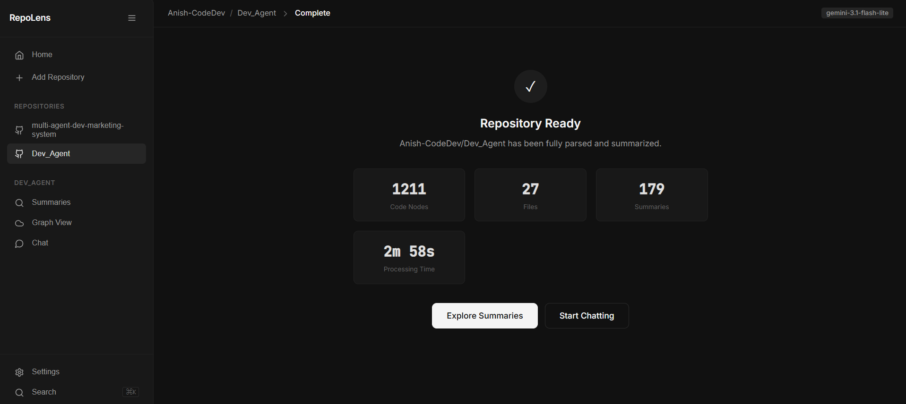
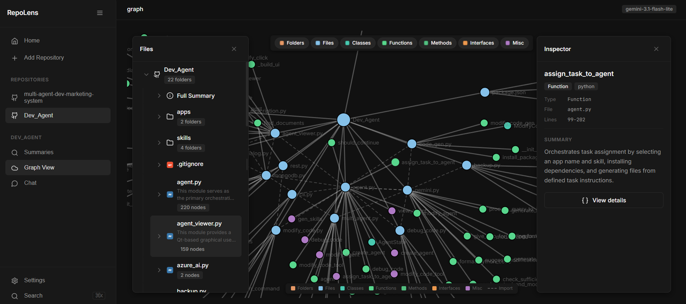
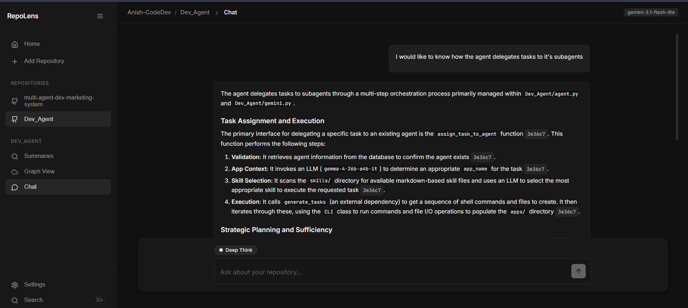
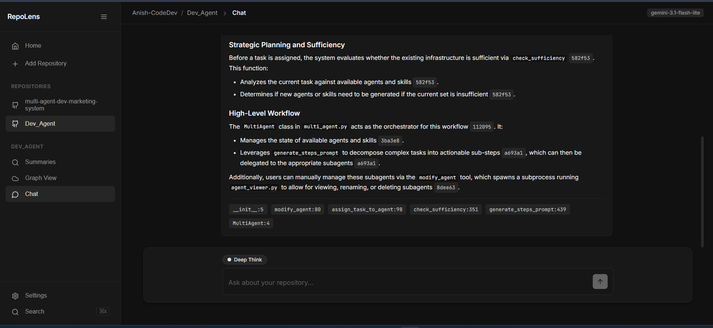

# RepoLens: A repository intelligence tool
*Mentors:* [Navya SG](https://github.com/Navya2022), [Arjun Gowda](https://github.com/Gowda-Arjun), [Ananya](https://github.com/ananya97br)

*Mentees:* [Anish Arvind Koikude](https://github.com/Anish-CodeDev), [Prajwal MM](https://github.com/dotpmm), [Ishaan Padashetty](https://github.com/ishaanpadashetty), [Harsh Pandya](https://github.com/Seaweed-Boi)

## Why do we need RepoLens?
Modern software engineering teams spend a significant fraction of their development cycle navigating unfamiliar codebases, tracing dependencies, and context-switching to answer structural questions. By combining an interactive dependency graph with targeted function searching and grounded AI retrieval, this repository intelligence tool eliminates the steep learning curve typically associated with onboarding onto complex or legacy repositories. Developers can instantly visualize how high-level architectural components map down to individual functions and classes, allowing them to trace blast radiuses and evaluate the upstream or downstream impacts of refactoring without manual code archeology.

Beyond structural visibility, the integration of a query engine backed by exact code citations directly addresses the reliability issues common in generic AI coding assistants. Providing immediate, traceable answers to technical questions enables engineers to self-serve context independently, which drastically minimizes internal interruptions and protects senior engineers' deep-work time. Ultimately, this project transforms raw source code into an easily navigable knowledge base, accelerating code reviews, streamlining debugging, and significantly reducing time-to-productivity for technical teams.
## Getting started
### Prerequisites
- Git(For cloning the repository)
- Python
- uv(A python package manager)
- *Optional*: CUDA supported GPU(Would be useful for generation of embeddings locally)
### Running this project locally
- Clone the Repo
- Run uv sync
- Run uvicorn main:app --host 0.0.0.0 --port 5000
## Working of RepoLens
`RepoLens` is built as a pipeline that turns a raw GitHub repository into a navigable, explainable knowledge graph of the codebase. Here's a breakdown of how each stage works.
### 1. Cloning of the repository
Everything starts when a user drops in a GitHub URL. Instead of trying to parse code remotely, `RepoLens` clones the repository locally first. This keeps the rest of the pipeline simple: every downstream stage just operates on a local file tree, and it means the tool can work with private repos, specific branches, or even local paths later on without changing the core logic.
### 2. AST Extraction with Tree-sitter
Once the repo is on disk, `RepoLens` walks every source file and parses it with tree-sitter to produce a concrete syntax tree. Rather than treating code as plain text, this gives structured access to functions, classes, imports, and their relationships: the same primitives a compiler would work with, but exposed to the rest of the pipeline as queryable nodes.

Why not just chunk the raw text like a typical RAG system would? Code isn't prose: a function's meaning is tied to its structure, not its paragraph breaks. Parsing with tree-sitter means a "chunk" is never an arbitrary slice of text; it's always a semantically complete unit like a function, a class, or a module.

### 3. File Tree Construction
`RepoLens` builds a hierarchical file tree of the whole repository: folders, files, and now the AST nodes extracted from each file all slot into one unified tree structure. This tree becomes the backbone for everything that follows: it's what gets visualized, what gets summarized, and what gets searched.

### 4. Hierarchical Summarization
This is where `RepoLens` turns raw structure into understanding. Every extracted node which can be a function, a class is first summarized individually. Then, moving up the tree, each parent node (a class made of its methods, a file made of its functions, a folder made of its files) obtains it's summaries by combining the summaries of it's children. The summaries of all the nodes are generated by a process of **batching**, where several nodes are sent to the llm to obtain their summaries rather than processing each node individually reducing number of calls made to the LLM.

This bottom-up approach keeps the context passed to the model small and relevant at every level, and it means a folder-level summary is genuinely informed by everything underneath it instead of being generated from a truncated blob of source code.

### 5. Vectorization of summaries
To let users actually converse with the repository, every node summary is embedded into a vector store. When a user asks a question, their query is embedded the same way and matched against these vectors: surfacing the most semantically relevant nodes, even when the user's wording doesn't match the code's exact terminology. This embedding layer is what turns a static summary tree into something queryable in natural language.

### 6. Interactive Graph Generation
With every node summarized, `RepoLens` renders the file tree as an interactive graph, where nodes represent files, functions, and classes, and edges represent structural or reference relationships between them. Clicking into a node surfaces its generated summary, letting a user explore an unfamiliar codebase visually instead of jumping between files in an editor.

### 7. Hybrid Search: BM25 over Nodes
Alongside the graph, every summarized node is indexed with BM25, giving users fast keyword-based search across the entire codebase: searching for a term like "auth middleware" surfaces the exact nodes (and their position in the tree) where that concept lives, ranked by relevance rather than requiring an exact filename match.

### 8. RAG-based Explanation with Citations
The final piece ties the graph, the summaries, and the search index together into a conversational agent. When a user asks a question about the project: "how does authentication work here?", the agent retrieves the most relevant nodes via RAG, then generates an answer grounded in those specific nodes. Every claim in the answer is tied back to a citation: the exact file, function, or class it came from, so the explanation is verifiable rather than a plausible-sounding guess.

This retrieval-grounded design is what separates `RepoLens` from just pointing a general-purpose LLM at a repo: because the agent's context comes from real, structurally-extracted nodes rather than arbitrary text chunks, every answer can point back to precisely where in the codebase it came from.

### Challenges and Learnings
- Limited LLM quota: This was resolved by using the process of batching(Instead of generating AI summaries of individual nodes, we generate the summaries of several nodes to reduce the number of API Calls)
- Limited Embedding model quota: This was resolved by giving the user an option to have their embeddings done locally

## Future Improvements
- **MCP Server Integration:** Expose RepoLens as an MCP server so agents like Claude Code, Cursor, etc. can query repository structure, dependencies, summaries, and relevant code context directly 
- **Multi-model & Local LLM Support:** Make the summarization and reasoning layer model agnostic, supporting cloud and locally hosted models
- **Incremental Repository Indexing:** Detect Git changes and update only affected nodes/summaries instead of rebuilding the entire repository analysis.

## Resources
- Project Repository: https://github.com/homebrew-ec-foss/RepoLens
- Treesitter: A python package used for parsing code and extracting nodes
- Qdrant: VectorDB used for the project